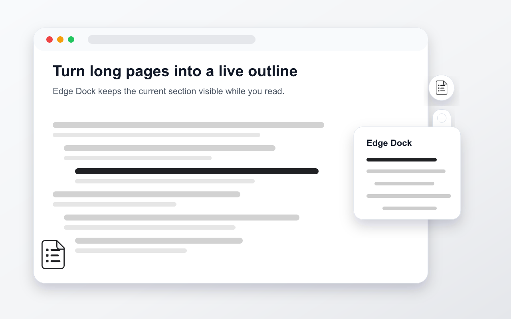

# Web TOC Assistant

[](LICENSE)
[](https://chromewebstore.google.com/detail/fnicpbioofepnfgpdhggjmhjalogbgcn)
[](https://microsoftedge.microsoft.com/addons/detail/jejjhfkmfdlccdbifpihkepaabcdlijc)
[](https://developer.chrome.com/docs/extensions/mv3/)

**[English](README.md)** | [中文](README_CN.md)

A web table of contents generator that automatically creates interactive floating TOC for any website to enhance reading experience.

<p align="left">
  
</p>

## ✨ Key Features

### 🎯 TOC Generation
- **Default Header Recognition**: Automatically uses page header structure (h1-h6 tags) when no selectors are configured
- **Enhanced Visibility Detection**: Advanced element filtering using computed styles, bounding rects, and parent clipping detection to ensure only truly visible elements are included
- **Automatic Filtering**: Automatically filters hidden elements (display:none, visibility:hidden, opacity:0), zero-size elements, and overflow-clipped content
- **Custom Selectors**: Supports CSS and XPath selectors to adapt to various website structures
- **Real-time Updates**: Automatically regenerates TOC when page content changes (500ms debounce)

### 🎪 Visual Element Picker
- **Hover Highlighting**: Real-time highlighting of target elements as you move your mouse
- **One-click Selector Generation**: Automatically generates CSS selector when you click an element
- **Config Saving**: Saves selectors as site-specific configurations
- **Automatic Exclusion**: Automatically excludes extension's own UI elements

### 📍 Flexible UI Interaction
- **Edge Dock**: Detached circular settings entry plus a compact TOC preview on the left or right edge
- **Live Outline Preview**: Collapsed TOC bars reflect heading levels, highlight the current reading position, and navigate directly when clicked
- **Hover Preview**: Hover over the outline bars to expand the TOC inward; moving away restores the bars automatically
- **Vertical Dragging**: Drag the dock up and down with mouse, touch, or stylus
- **Position Memory**: Remembers dock side and vertical position per domain and constrains the dock after window resize
- **Classic Mode**: Switch globally to the classic text badge and freely draggable floating panel when preferred
- **Smooth Scrolling**: Smooth scroll to content when clicking TOC items

### 🔄 Navigation Experience
- **Current Position Highlighting**: Automatically highlights the TOC item corresponding to current reading position (IntersectionObserver)
- **Navigation Locking**: Locks highlighting during user clicks to prevent jumping
- **Navigation Lock Failsafe**: Auto-unlocks after timeout if stuck
- **State Recovery**: Automatically restores highlight state after page changes
- **Anti-Jump Mechanism**: Prevents page jumping during auto-refresh and rebuilds

### ⚙️ Site Configuration Management
- **Wildcard Matching**: URL pattern matching with wildcard support (e.g., `https://example.com/*`)
- **Local Storage**: Configuration and site enable state saved to `chrome.storage.local`
- **Config Management**: View and clear site configurations
- **Multi-selector Support**: Configure multiple CSS/XPath selectors per site

### 🌐 Multi-site Control
- **Per-site Enable/Disable**: Independent control for each website
- **Icon Status Indicator**: The transparent white-document toolbar icon turns black when enabled and gray when disabled
- **Cross-tab Sync**: Automatic state synchronization across tabs of the same site

## 🚀 Installation & Usage

### Installation

#### Method 1: Install from Web Store (Recommended)

1. **Chrome**: Visit [Chrome Web Store](https://chromewebstore.google.com/detail/fnicpbioofepnfgpdhggjmhjalogbgcn)
2. **Edge**: Visit [Microsoft Edge Add-ons](https://microsoftedge.microsoft.com/addons/detail/jejjhfkmfdlccdbifpihkepaabcdlijc)
3. Click "Add to Chrome/Edge" to install
4. Visit any webpage to start using

#### Method 2: Load Unpacked Extension (Developer Mode)

1. Download project files to your local machine
2. Run `npm run build` from the project root
3. Open Chrome browser and navigate to `chrome://extensions/` or Edge browser to `edge://extensions/`
4. Enable "Developer Mode"
5. Click "Load unpacked" and select the `dist/build` folder
6. Visit any webpage to start using

### Basic Operations

#### 1. Enable/Disable Extension

**How**: Click the "Web TOC Assistant" icon in the browser toolbar

**Effect**:
- Enabled state: The transparent white-document icon turns black, and the edge-docked TOC toolbar appears on page
- Disabled state: The transparent white-document icon turns gray, and the dock disappears
- Sync effect: Other tabs of the same site automatically sync state

#### 2. Expand TOC Panel

**How**:
- Desktop: Hover over the outline bars to expand the TOC; move away from both the bars and list to collapse it
- Touch devices: Tap the TOC area to toggle a temporary panel, then tap outside to collapse it
- Collapsed state: Click a horizontal outline bar to navigate directly without pinning the panel open

**Default Behavior**:
- Automatically recognizes h1-h6 headers on the page
- Displays floating panel on left or right side
- Shows current page content structure

#### 3. Quick Navigation

**How**: Click any item in the TOC

**Effect**:
- Smooth scroll to corresponding content
- Auto-highlight current reading position
- Support keyboard arrow keys for navigation

#### 4. Pick Element (Custom Selector)

**When to use**: Default header recognition is inaccurate, or need to identify other elements

**Steps**:
1. Expand the TOC panel
2. Click the settings icon in the edge dock, then click "Pick Element"
3. Move mouse over the page - target elements will be highlighted
4. Click the element you want to identify
5. CSS selector is auto-generated and previewed
6. Click "Save as Site Config" to save selector as current site configuration

**Notes**:
- Press ESC to cancel pick mode
- Right-click also cancels pick mode
- Auto-cancels after 20 seconds of inactivity
- Won't select extension's own UI elements

#### 5. Manage Site Configuration

**How**: Click the settings icon in the edge dock, then click "Site Configuration"

**Functions**:
- View all configurations for current site
- Clear current site configuration
- View URL matching rules

#### 6. Adjust Dock Position

**How**:
- Drag either dock icon vertically
- Use "Move to left side" or "Move to right side" in quick settings to switch edges

**Effect**:
- Dock position and side are remembered per domain
- Automatically restores on page refresh or next visit
- Keeps the dock attached to the selected edge with safe top and bottom margins
- On window resize, the vertical position is constrained to the visible viewport
- Uses default position if saved position is out of viewport

#### 7. Refresh TOC

**How**: Click the settings icon in the edge dock, then click "Refresh"

**When to use**:
- After dynamic page content changes
- When suspecting TOC is inaccurate

#### 8. Switch Interface Mode

**How**:
- Modern Edge Dock: open quick settings and click "Switch to classic mode"
- Classic panel: click "Switch to Modern UI"

**Effect**:
- The preference is global and applies immediately across open tabs
- Modern mode is the default
- Classic mode keeps the classic text badge and freely draggable panel interaction

### Advanced Usage

#### URL Matching Rules

Configuration supports wildcard matching:
- Exact match: `https://example.com/page`
- Domain match: `https://example.com/*`
- Path match: `https://example.com/docs/*`

#### Multi-selector Configuration

You can configure multiple selectors for the same site:
```json
{
  "urlPattern": "https://example.com/*",
  "selectors": [
    { "type": "css", "expr": "h1, h2, h3" },
    { "type": "css", "expr": ".article-title" },
    { "type": "xpath", "expr": "//article//h2" }
  ]
}
```

#### XPath Selectors

For complex page structures, you can use XPath:
- `//article//h2` - All h2 under article
- `//*[@class='title']` - Any element with class "title"
- `//div[@id='content']//h3` - Headers within specific container

### Advanced Features

#### Edge Dock

**Effect**:
- Hover previews the TOC without changing saved expanded state
- The collapsed outline preview shows up to 12 nearby headings; deeper headings use shorter indented bars
- Clicking a collapsed outline bar navigates directly without pinning the card open
- Moving away from the bars and list restores the collapsed outline automatically
- Touch devices can temporarily toggle the card and dismiss it by tapping outside
- Quick settings expose refresh, element picker, site configuration, and edge switching
- The detached circular settings button uses the extension's monochrome list mark
- Quick settings can switch globally to the classic interface

## 🛠️ Technical Implementation

### Project Structure

```
├── manifest.json              # Manifest V3 configuration
├── build.js                   # Build & packaging script
├── package.json               # Node.js metadata
├── icons/                     # Extension icons
│   ├── png/                   # PNG icons (16/32/48/128)
│   │   ├── toc-enabled-*.png  # Enabled state icons
│   │   └── toc-disabled-*.png # Disabled state icons
│   └── svg/                   # SVG source files
├── docs/brand/                # 1.0 brand assets and Chrome Web Store visuals
├── _locales/                  # Internationalization
│   ├── en/
│   │   └── messages.json      # English translation
│   └── zh_CN/
│       └── messages.json      # Chinese translation
├── src/
│   ├── background.js          # Background service worker
│   ├── content.js             # Content script entry (ESM)
│   ├── content.css            # Content script styles
│   ├── utils/                 # Utility modules
│   │   ├── constants.js       # Storage keys, UI constants
│   │   ├── core-utils.js      # Type checks, i18n, validation
│   │   ├── toast.js           # Toast notifications
│   │   ├── storage.js         # Storage I/O and normalization
│   │   ├── toc-utils.js       # Aggregate re-exports for convenience
│   │   ├── badge-position.js  # Badge position persistence
│   │   ├── dom-utils.js       # DOM ops, URL matching, site state
│   │   ├── css-selector.js    # CSS selector generation
│   │   ├── focus-trap.js      # Focus trap utility
│   │   ├── toc-builder.js     # TOC building logic
│   │   └── drag-helper.js     # Pointer-event drag controller
│   ├── shared/                # Shared between contexts
│   │   └── primitives.js            # Shared storage, config, and UI state utilities (ESM source; build produces IIFE for background)
│   ├── ui/                    # UI components
│   │   ├── edge-dock.js       # Edge-docked toolbar and hover-only TOC state
│   │   ├── classic-collapsed-badge.js # Original text badge interaction
│   │   ├── classic-floating-panel.js  # Original freely draggable panel shell
│   │   ├── element-picker.js  # Element picker
│   │   ├── floating-panel.js  # Shared lightweight TOC list card
│   │   └── floating-panel-helpers.js # Extracted panel helpers
│   └── core/                  # Core logic
│       ├── nav-lock.js        # Navigation lock module
│       ├── config-manager.js  # Configuration management
│       ├── dom-watcher.js     # MutationObserver wrapper
│       ├── url-monitor.js     # URL/hash change monitor
│       ├── rebuild-scheduler.js # Rebuild scheduling & coordination
│       └── toc-app.js         # Main application logic
├── docs/                      # Documentation assets
│   ├── PRIVACY_POLICY.md      # Privacy policy
│   └── descriptions/          # Screenshots & store descriptions
├── CLAUDE.md                  # Claude Code development guide
└── README_CN.md               # Chinese version (中文版)
```

### Brand Assets

Run `npm run assets:brand` to regenerate the 1.0 transparent white-document icon set and bilingual Chrome Web Store visual assets. The generated package includes toolbar/store PNG icons, master SVG marks, 440×280 small promotional tiles, 1400×560 marquee tiles, and 1280×800 screenshot cover images under `docs/brand/`.

### Core Technologies

- **Runtime**: Edge/Chrome browser (Chromium-based)
- **Extension Standard**: Manifest V3
- **Language**: Vanilla JavaScript + CSS3 (ES Modules, bundled with esbuild)
- **Storage**: `chrome.storage.local` API
- **Permissions**: `storage`, `tabs`, `scripting`
- **Host Permissions**: `http://*/*`, `https://*/*`

### Architecture

**ES Modules + esbuild**: Source code uses standard ESM `import`/`export`. esbuild bundles the content script tree into a single IIFE at build time. No runtime module loading or load-order concerns.

**Content Script Dependency Graph**:
```
src/content.js (entry)
  ├── utils/toc-utils.js (barrel re-export of all utils)
  └── core/toc-app.js (orchestrator)
        ├── ui/ components (edge-dock, element-picker, floating-panel)
        ├── core/config-manager.js → focus-trap.js
        └── core/rebuild-scheduler.js → dom-watcher.js, url-monitor.js, nav-lock.js
```

**Background Script**: Uses `importScripts()` to load the IIFE bundle of `primitives.js` produced by the build (MV3 service workers cannot use ESM).

**Shared Primitives**: `primitives.js` is ESM source; the build produces a separate IIFE bundle for the background service worker.

### Key Algorithms

- **Element Deduplication**: Set-based O(n) dedup preserving first-occurrence order
- **Tiered Visibility Filtering**: Three-phase check — cheap DOM checks first, then style/geometry, then parent clipping — with short-circuit at item limit
- **Hidden Element Filtering**: Checks `display:none`, `visibility:hidden`, `opacity:0`, zero dimensions
- **Debounced Rebuild**: MutationObserver + dynamic debounce (500ms–1s) to avoid frequent updates
- **Selector Generation**: Prioritizes class selector, falls back to path selector
- **Navigation Lock**: Locks IntersectionObserver during user clicks to prevent jumping
- **Navigation Lock Failsafe**: Auto-unlocks after timeout (8s) if stuck
- **Animation Frame Management**: Schedules and cleans up requestAnimationFrame callbacks
- **Storage Quota Handling**: Auto-prunes old data when quota exceeded
- **Serialized Config Writes**: Applies selector changes in the background service worker with validation and serialized storage writes

## 📖 Configuration Format

Site configuration is stored in `chrome.storage.local`:

```json
{
  "tocConfigs": [
    {
      "urlPattern": "https://example.com/*",
      "side": "right",
      "selectors": [
        { "type": "css", "expr": "h1, h2, h3, h4, h5, h6" },
        { "type": "css", "expr": ".article-title, .section-header" },
        { "type": "xpath", "expr": "//article//h2[@class='title']" }
      ]
    }
  ],
  "tocSiteEnabledMap": {
    "https://example.com": true,
    "https://another.com": false
  },
  "tocPanelExpandedMap": {
    "https://example.com": true
  },
  "tocBadgePosMap": {
    "example.com": { "x": 100, "y": 200 }
  }
}
```

**Field Description**:
- `urlPattern`: URL matching pattern with `*` wildcard support
- `side`: Panel display position (`left` or `right`)
- `selectors`: Selector array, supports mixing CSS and XPath
- `tocBadgePosMap`: Dock anchor position per domain (legacy key retained for compatibility; includes `x`, `y`, `anchorX`)

## 🎯 Use Cases

| Scenario | Description | Benefit |
|----------|-------------|---------|
| 📚 **Technical Docs** | Long API docs, tutorials | Quick chapter navigation, improved lookup efficiency |
| 📝 **Blog Posts** | Long articles, in-depth analysis | Clear article structure, easy skimming |
| 🌐 **Forum Threads** | Long posts, discussions | Quickly find points of interest |
| 📖 **Online Tutorials** | Step-by-step tutorials, courses | Navigate learning progress step by step |
| 🔍 **Research Materials** | Academic papers, reports | Improved information retrieval and reading efficiency |

## 🔧 FAQ

### Q: Can't see the "TOC" button?
**A:** Check the following:
1. Confirm extension is properly installed and enabled
2. Click toolbar icon to confirm current site is enabled
3. Confirm page protocol is http or https (file:// not supported)
4. Try refreshing the page

### Q: TOC is empty or inaccurate?
**A:** Extension defaults to recognizing h1-h6 tags. If page structure is special:
1. Use "Pick Element" feature to configure appropriate selectors for the site
2. Click "Refresh" to re-scan the page
3. Try using XPath selectors for more precise matching

### Q: TOC highlight jumps or out of sync?
**A:** This is normal debouncing behavior:
1. Highlight auto-corrects after scrolling stops
2. Clicking TOC items locks navigation to prevent jumping
3. Page content changes trigger re-scanning

### Q: Dock position wrong or missing?
**A:**
1. Drag the edge dock vertically to a suitable position; it auto-saves
2. Uses default position if saved position is out of viewport
3. Clearing browser cache may reset position

### Q: Configuration not taking effect?
**A:**
1. Check if URL matching rules are correct
2. Confirm selector syntax is correct
3. Try refreshing page or reloading extension

### Q: Extension not working on a specific website?
**A:**
1. Some websites may have CSP (Content Security Policy) restrictions
2. Shadow DOM usage may cause selector failures
3. Try using XPath selectors

## 🔧 Development Guide

### Build & Packaging
Source code uses ES Modules, bundled with esbuild at build time:
- Edit files directly — esbuild resolves ESM imports at build time
- Run `npm run build` to bundle with esbuild, validate syntax, and create a distributable zip
- The build script produces `dist/build/src/content.js` (bundled IIFE) and creates `dist/packages/v{version}.zip`
- Load `dist/build` in Developer Mode. The project root contains ESM source files and is not a runnable unpacked extension directory.

### Debugging
1. **Background Page**: Click "Service Worker" at `edge://extensions/` to view background logs
2. **Content Script**: Press F12 on target webpage to view Console logs
3. **Storage View**: View `chrome.storage.local` in DevTools > Application > Storage

### Adding New Features
1. Create new file in appropriate module directory (`utils/`, `ui/`, `core/`, `shared/`)
2. Use `export` for the module's public API
3. `import` from the module wherever needed (esbuild resolves at build time)
4. If it's a utility, consider adding to `utils/toc-utils.js` barrel re-export

For detailed technical documentation, see [`CLAUDE.md`](CLAUDE.md).

## 🤝 Contributing

Issues and Pull Requests are welcome!

1. Fork this project
2. Create feature branch: `git checkout -b feature/new-feature`
3. Commit changes: `git commit -m 'Add new feature'`
4. Push branch: `git push origin feature/new-feature`
5. Create Pull Request

## 📄 License

This project is licensed under the MIT License - see [LICENSE](LICENSE) file for details.

## 🗺️ Roadmap

### Smart Auto-Detection (Planned)

Currently, the TOC relies on default h1-h6 heading recognition or manually configured CSS/XPath selectors via the element picker. Future versions plan to introduce intelligent auto-detection capabilities:

- **Automatic Content Structure Analysis**: Automatically identify the main content area and heading structure of a page, reducing the need for manual selector configuration
- **Adaptive Recognition**: Learn from common page layouts and frameworks to improve detection accuracy across different websites
- **Gradual Selector Deprecation**: As auto-detection matures, the manual selector list will gradually become a fallback for edge cases rather than the primary configuration method

The goal is to make the TOC "just work" out of the box for the vast majority of websites, while keeping manual customization available as an advanced option.

## 📝 Changelog

See [CHANGELOG.md](CHANGELOG.md) for version history and updates. [中文更新日志](CHANGELOG_CN.md)

---

**If this project helps you, please give it a ⭐ Star!**
