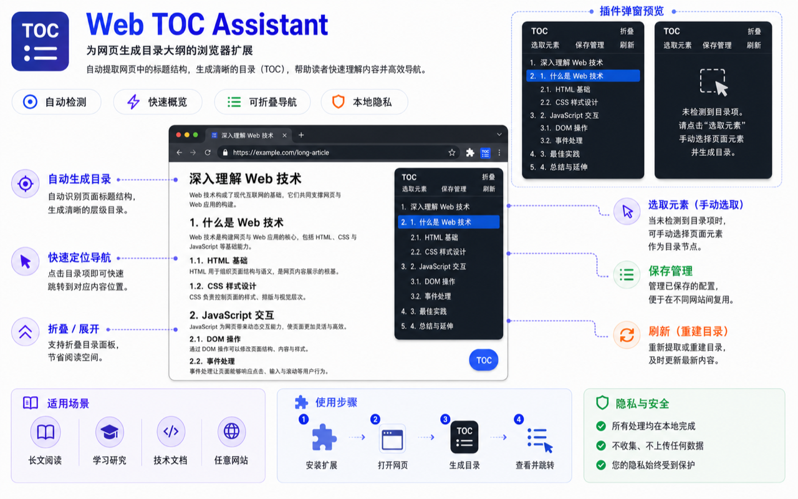

# 网页目录助手 / Web TOC Assistant

[](LICENSE)
[](https://chromewebstore.google.com/detail/fnicpbioofepnfgpdhggjmhjalogbgcn)
[](https://microsoftedge.microsoft.com/addons/detail/jejjhfkmfdlccdbifpihkepaabcdlijc)
[](https://developer.chrome.com/docs/extensions/mv3/)

**[English](README.md)** | [中文](README_CN.md)

一个网页目录生成器，为任意网站自动创建可交互的浮动目录，提升阅读体验。

<p align="left">
  
</p>

## ✨ 核心功能

### 🎯 目录生成
- **默认标题识别**：没有配置选择器时，自动使用页面标题结构（h1-h6标签）
- **增强可见性检测**：增强的元素过滤，使用计算样式、边界矩形和父元素裁剪检测，确保只包含真正可见的元素
- **自动过滤**：自动过滤隐藏元素（display:none、visibility:hidden、opacity:0）、零尺寸元素和溢出裁剪内容
- **自定义选择器**：支持CSS和XPath选择器，适配各种网站结构
- **实时更新**：页面内容变化时自动重新生成目录（防抖500ms）

### 🎪 可视化元素拾取
- **鼠标悬停高亮**：移动鼠标实时高亮目标元素
- **一键生成选择器**：点击元素自动生成CSS选择器
- **配置保存**：将选择器保存为站点专属配置
- **自动排除**：自动排除扩展自身的UI元素

### 📍 灵活的界面交互
- **吸附式工具条**：设置与 TOC 图标紧贴页面左侧或右侧
- **实时目录缩略图**：收起态横线体现标题层级，并高亮当前阅读位置
- **悬停预览**：桌面端悬停临时预览，点击锁定展开；触屏设备点击切换
- **上下拖动**：支持鼠标、触摸屏和触控笔上下拖动整个工具条
- **位置记忆**：按域名记住吸附侧边和竖直位置，窗口尺寸变化后自动约束到可见区域
- **平滑滚动**：点击目录项平滑滚动到对应位置

### 🔄 导航体验
- **当前位置高亮**：自动高亮当前阅读位置对应的目录项（IntersectionObserver）
- **导航锁定**：用户点击导航时锁定高亮，防止滚动时跳动
- **导航锁故障保护**：锁定卡死时8秒后自动解锁（v0.6.0+新增）
- **状态恢复**：页面变化后自动恢复高亮状态
- **防跳动机制**：防止定时刷新和重建时页面跳动

### ⚙️ 站点配置管理
- **通配符匹配**：使用URL模式匹配，支持通配符（如 `https://example.com/*`）
- **本地存储**：配置与站点启用状态保存到 `chrome.storage.local`
- **配置管理**：可查看、清空站点配置
- **多选择器支持**：同一站点可配置多个CSS/XPath选择器

### 🌐 多站点控制
- **按站点启用/禁用**：每个站点独立控制扩展是否生效
- **图标状态指示**：启用=蓝色图标，禁用=灰色图标
- **跨标签同步**：同一站点的多个标签页自动同步状态

## 🚀 安装使用

### 安装步骤

#### 方法一：从应用商店安装（推荐）

1. **Chrome 浏览器**：访问 [Chrome 网上应用店](https://chromewebstore.google.com/detail/fnicpbioofepnfgpdhggjmhjalogbgcn)
2. **Edge 浏览器**：访问 [Microsoft Edge 加载项](https://microsoftedge.microsoft.com/addons/detail/jejjhfkmfdlccdbifpihkepaabcdlijc)
3. 点击"添加至 Chrome/Edge"按钮安装
4. 安装完成后访问任意网页即可使用

#### 方法二：加载已解压的扩展程序（开发者模式）

1. 下载项目文件到本地
2. 在项目根目录运行 `npm run build`
3. 打开 Chrome 浏览器访问 `chrome://extensions/` 或 Edge 浏览器访问 `edge://extensions/`
4. 开启"开发人员模式"（Developer Mode）
5. 点击"加载已解压的扩展程序"（Load unpacked），选择 `dist/build` 文件夹
6. 安装完成后访问任意网页即可使用

### 基本操作

#### 1. 启用/禁用扩展

**操作方式**：点击浏览器工具栏中的"网页目录助手"图标

**效果**：
- 启用状态：图标变为蓝色，页面边缘出现吸附式目录工具条
- 禁用状态：图标变为灰色，工具条消失
- 同步效果：同一站点的其他标签页会自动同步状态

#### 2. 展开目录面板

**操作方式**：
- 桌面端：鼠标悬停 TOC 图标临时预览，点击图标可锁定展开
- 触屏设备：点击 TOC 图标切换展开与收起
- 收起态最多显示当前阅读位置附近的 12 个标题，层级越深横线越短并向内缩进
- 展开态为无标题栏的轻量目录卡片

**默认行为**：
- 自动识别页面中的 h1-h6 标题
- 在左侧或右侧显示浮动面板
- 显示当前页面内容结构

#### 3. 快速导航

**操作方式**：点击目录中的任意项

**效果**：
- 平滑滚动到对应内容位置
- 自动高亮当前阅读位置
- 支持键盘方向键上下选择

#### 4. 拾取元素（自定义选择器）

**适用场景**：页面默认识别的标题不准确，或需要识别其他元素

**操作步骤**：
1. 展开目录面板
2. 点击吸附工具条中的设置图标，再点击"拾取元素"
3. 鼠标在页面上移动，会高亮显示目标元素
4. 点击想要识别的元素
5. 自动生成CSS选择器并显示预览
6. 点击"保存"将选择器保存为当前站点配置

**注意事项**：
- 拾取模式下按 ESC 键可取消
- 右键点击也可取消拾取
- 拾取模式20秒无操作自动取消
- 不会选中扩展自身的UI元素

#### 5. 管理站点配置

**操作方式**：点击吸附工具条中的设置图标，再点击"站点配置"

**功能**：
- 查看当前站点的所有配置
- 清空当前站点的配置
- 查看配置的URL匹配规则

#### 6. 调整工具条位置

**操作方式**：
- 上下拖拽任一工具条图标
- 在快捷设置中使用"移动到左侧"或"移动到右侧"切换吸附边缘

**效果**：
- 工具条会记住当前高度和吸附侧边（按域名保存）
- 刷新页面或下次访问时自动恢复
- 始终贴合选定侧边，并保留上下安全边距
- 窗口尺寸变化时自动约束到可见区域
- 如果保存的位置超出屏幕，自动使用默认位置

#### 7. 刷新目录

**操作方式**：点击吸附工具条中的设置图标，再点击"刷新"

**适用场景**：
- 页面内容动态变化后需要重新扫描
- 怀疑目录不准确时

### 高级功能

### 高级使用

#### URL 匹配规则

配置支持通配符匹配：
- 精确匹配：`https://example.com/page`
- 域名匹配：`https://example.com/*`
- 路径匹配：`https://example.com/docs/*`

#### 多选择器配置

可以为同一站点配置多个选择器：
```json
{
  "urlPattern": "https://example.com/*",
  "selectors": [
    { "type": "css", "expr": "h1, h2, h3" },
    { "type": "css", "expr": ".article-title" },
    { "type": "xpath", "expr": "//article//h2" }
  ]
}
```

#### XPath 选择器

对于复杂的页面结构，可以使用XPath：
- `//article//h2` - article 下的所有 h2
- `//*[@class='title']` - 任何 class 为 title 的元素
- `//div[@id='content']//h3` - 特定容器内的标题

## 🛠️ 技术实现

### 项目结构

```
├── manifest.json              # Manifest V3 配置文件
├── icons/                     # 扩展图标
│   ├── png/                   # PNG 图标（16/32/48/128）
│   │   ├── toc-enabled-*.png  # 启用状态图标
│   │   └── toc-disabled-*.png # 禁用状态图标
│   └── svg/                   # SVG 源文件
├── _locales/                  # 国际化文件
│   ├── en/
│   │   └── messages.json      # 英文翻译
│   └── zh_CN/
│       └── messages.json      # 中文翻译
├── build.js                   # 构建和打包脚本
├── package.json               # Node.js 元数据
├── src/
│   ├── background.js          # 后台服务工作者
│   ├── content.js             # 内容脚本入口（ESM）
│   ├── content.css            # 内容脚本样式
│   ├── utils/                 # 工具模块
│   │   ├── constants.js       # 存储键名、UI 常量
│   │   ├── core-utils.js      # 类型检查、国际化、验证
│   │   ├── toast.js           # Toast 通知
│   │   ├── storage.js         # 存储 I/O 和标准化
│   │   ├── toc-utils.js       # 聚合重导出，方便引用
│   │   ├── badge-position.js  # 按钮位置持久化
│   │   ├── dom-utils.js       # DOM 操作、URL 匹配、站点状态
│   │   ├── css-selector.js    # CSS 选择器生成
│   │   ├── focus-trap.js      # 焦点陷阱工具
│   │   ├── toc-builder.js     # TOC 构建逻辑
│   │   └── drag-helper.js     # Pointer Events 拖拽控制器
│   ├── shared/                # 跨上下文共享模块
│   │   └── storage-primitives.js     # 存储工具（ESM 源码；构建时产出 background 可 importScripts 的 IIFE）
│   ├── ui/                    # UI 组件
│   │   ├── edge-dock.js       # 吸附工具条与 hover/pinned 状态
│   │   ├── element-picker.js  # 元素拾取器
│   │   ├── floating-panel.js  # 浮动面板
│   │   └── floating-panel-helpers.js # 提取的面板辅助函数
│   └── core/                  # 核心逻辑
│       ├── nav-lock.js        # 导航锁定模块
│       ├── config-manager.js  # 配置管理
│       ├── dom-watcher.js     # MutationObserver 封装
│       ├── url-monitor.js     # URL/hash 变更监控
│       ├── rebuild-scheduler.js # 重建调度与协调
│       ├── event-bus.js       # 轻量事件总线（发布/订阅）
│       └── toc-app.js         # 主应用逻辑
├── docs/                      # 文档资源
│   ├── PRIVACY_POLICY.md      # 隐私政策
│   └── descriptions/          # 截图与应用商店描述
├── CLAUDE.md                  # Claude Code 开发指南
└── README.md                  # 英文版
```

### 核心技术

- **运行环境**：Edge/Chrome 浏览器（Chromium 内核）
- **扩展标准**：Manifest V3
- **开发语言**：原生 JavaScript + CSS3（ES Modules，使用 esbuild 打包）
- **存储方案**：`chrome.storage.local` API
- **权限需求**：`storage`、`tabs`、`scripting`、`alarms`
- **站点权限**：`http://*/*`、`https://*/*`

### 架构设计

**ES Modules + esbuild**：源码使用标准 ESM `import`/`export`。构建时 esbuild 将内容脚本依赖树打包为单个 IIFE，无需运行时模块加载或加载顺序管理。

**内容脚本依赖图**：
```
src/content.js（入口）
  ├── utils/toc-utils.js（工具模块聚合重导出）
  └── core/toc-app.js（编排器）
        ├── ui/ 组件（吸附工具条、元素拾取器、浮动面板）
        ├── core/config-manager.js → event-bus.js, focus-trap.js
        └── core/rebuild-scheduler.js → dom-watcher.js, url-monitor.js, nav-lock.js
```

**后台脚本**：通过 `importScripts()` 加载构建产出的 `storage-primitives.js` IIFE bundle（MV3 service worker 不支持 ESM）。

**共享存储原语**：`storage-primitives.js` 是 ESM 源码；构建时产出单独的 IIFE bundle 供后台 service worker 使用。

### 关键算法

- **元素去重**：基于 Set 的 O(n) 去重，保持首次出现顺序
- **分层可见性过滤**：三阶段检查 — 先做轻量 DOM 检查，再读样式/几何信息，最后检查父元素裁剪 — 达到条目上限时提前终止
- **隐藏元素过滤**：检测 `display:none`、`visibility:hidden`、`opacity:0`、零尺寸等
- **防抖重建**：MutationObserver + 动态防抖（500ms–1s）避免频繁更新
- **选择器生成**：优先使用 class 选择器，回退到路径选择器
- **导航锁定**：用户点击时锁定 IntersectionObserver，防止跳动
- **导航锁故障保护**：卡死时超时自动解锁（默认8秒）
- **动画帧管理**：调度和清理 requestAnimationFrame 回调
- **存储配额处理**：配额超出时自动修剪旧数据
- **配置变更重试**：失败时重试配置变更并验证结果

## 📖 配置格式

站点配置保存在 `chrome.storage.local` 中：

```json
{
  "tocConfigs": [
    {
      "urlPattern": "https://example.com/*",
      "side": "right",
      "selectors": [
        { "type": "css", "expr": "h1, h2, h3, h4, h5, h6" },
        { "type": "css", "expr": ".article-title, .section-header" },
        { "type": "xpath", "expr": "//article//h2[@class='title']" }
      ],
      "collapsedDefault": false
    }
  ],
  "tocSiteEnabledMap": {
    "https://example.com": true,
    "https://another.com": false
  },
  "tocPanelExpandedMap": {
    "https://example.com": true
  },
  "tocBadgePosMap": {
    "example.com": { "x": 100, "y": 200 }
  }
}
```

**字段说明**：
- `urlPattern`：URL 匹配模式，支持 `*` 通配符
- `side`：面板显示位置（`left` 或 `right`）
- `selectors`：选择器数组，支持 CSS 和 XPath 混用
- `collapsedDefault`：默认是否折叠
- `tocBadgePosMap`：工具条吸附位置存储（保留旧键名以兼容历史数据），包含 `x`、`y`、`anchorX`

## 🎯 适用场景

| 场景 | 描述 | 效果 |
|------|------|------|
| 📚 **技术文档** | 长篇 API 文档、教程 | 快速定位章节，提升查阅效率 |
| 📝 **博客文章** | 长文章、深度分析 | 一目了然的文章结构，便于跳读 |
| 🌐 **论坛帖子** | 长帖、讨论串 | 快速找到感兴趣的讨论点 |
| 📖 **在线教程** | 分步教程、课程内容 | 按步骤快速导航学习进度 |
| 🔍 **研究资料** | 学术论文、报告 | 提高信息检索和阅读效率 |

## 🔧 常见问题

### Q: 看不到"目录"按钮？
**A:** 检查以下几点：
1. 确认扩展已正确安装并启用
2. 点击工具栏图标，确认当前站点已启用
3. 确认页面协议为 http 或 https（不支持 file:// 等其他协议）
4. 刷新页面重试

### Q: 目录为空或不准确？
**A:** 扩展会默认识别 h1-h6 标题标签。如果页面结构特殊：
1. 使用"拾取元素"功能为当前站点配置合适的选择器
2. 点击"刷新"重新扫描页面
3. 尝试使用 XPath 选择器进行更精确的匹配

### Q: 目录高亮跳动或不同步？
**A:** 这是正常的防抖机制：
1. 滚动停止后会自动恢复正确的高亮状态
2. 点击目录项时会锁定导航，防止跳动
3. 页面内容变化后会重新扫描

### Q: 工具条位置不对或丢失？
**A:**
1. 可以上下拖拽吸附工具条到合适位置，位置会自动保存
2. 如果保存的位置超出屏幕，会自动使用默认位置
3. 清空浏览器缓存可能会重置位置

### Q: 配置不生效？
**A:**
1. 检查 URL 匹配规则是否正确
2. 确认选择器语法无误
3. 尝试刷新页面或重新加载扩展

### Q: 扩展在某个网站不工作？
**A:**
1. 某些网站可能有 CSP（内容安全策略）限制
2. 页面使用了 Shadow DOM 可能导致选择器失效
3. 尝试使用 XPath 选择器

## 🔧 开发指南

### 构建与打包
源码使用 ES Modules，构建时通过 esbuild 打包：
- 直接编辑文件即可 — esbuild 在构建时解析 ESM 导入
- 运行 `npm run build` 使用 esbuild 打包、验证语法并创建分发包
- 构建脚本生成 `dist/build/src/content.js`（IIFE bundle）并创建 `dist/packages/v{版本号}.zip`
- 开发者模式请加载 `dist/build`。项目根目录包含 ESM 源码文件，不是可直接运行的已解压扩展目录。

### 调试方法
1. **后台页面调试**：在 `edge://extensions/` 页面点击"Service Worker"查看后台日志
2. **内容脚本调试**：在目标网页按 F12 打开开发者工具，查看 Console 日志
3. **存储查看**：在开发者工具的 Application > Storage 中查看 `chrome.storage.local`

### 添加新功能
1. 在对应模块目录创建新文件（`utils/`、`ui/`、`core/`、`shared/`）
2. 使用 `export` 导出模块的公共 API
3. 在需要使用的模块中通过 `import` 引入（esbuild 在构建时自动解析）
4. 如果是工具函数，考虑添加到 `utils/toc-utils.js` 的 barrel 重导出

详细的技术文档请查看 [`CLAUDE.md`](CLAUDE.md)。

## 🤝 贡献指南

欢迎提交 Issue 和 Pull Request！

1. Fork 本项目
2. 创建功能分支：`git checkout -b feature/new-feature`
3. 提交更改：`git commit -m 'Add new feature'`
4. 推送分支：`git push origin feature/new-feature`
5. 创建 Pull Request

## 📄 开源协议

本项目采用 MIT 开源协议 - 详见 [LICENSE](LICENSE) 文件。

## 📝 更新日志

查看 [更新日志](CHANGELOG_CN.md) 了解版本历史和更新内容。 [English Changelog](CHANGELOG.md)

---

**如果这个项目对你有帮助，请给个 ⭐ Star 支持一下！**

*If this project helps you, please give it a ⭐ Star!*
